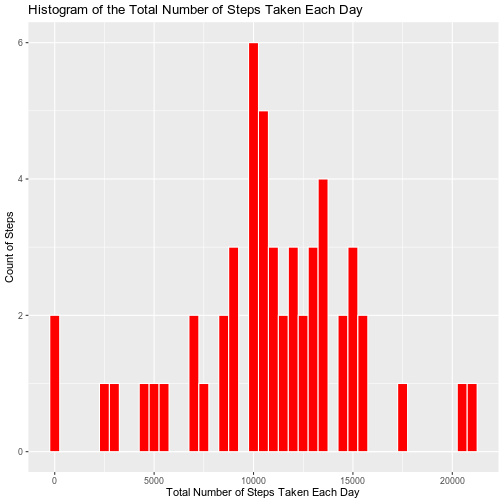
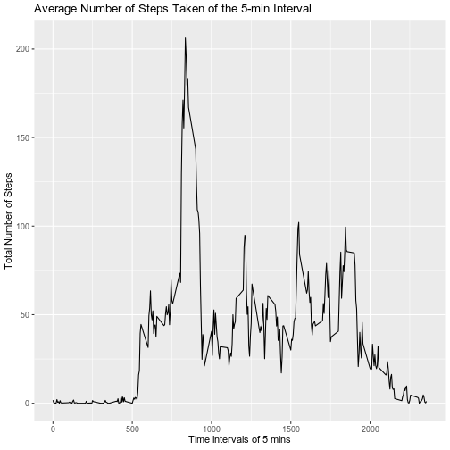
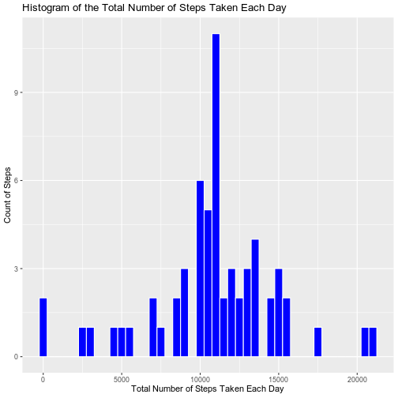
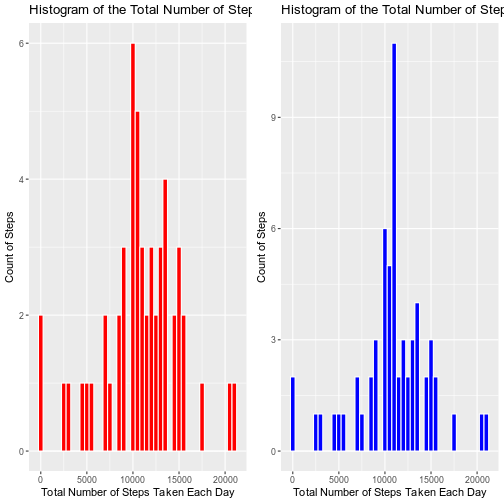
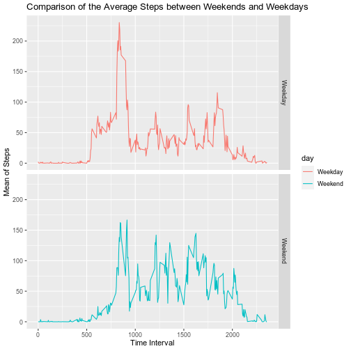

Peer Assignment 1:Reproducible Research
=======================================================

### Loading the data and then processing it  
Loading the data from the web, unzipping the .zip file and reading it as a .csv file  

```r
#downloading the file from its location
download.file("https://d396qusza40orc.cloudfront.net/repdata%2Fdata%2Factivity.zip", destfile = "activity.zip", mode="wb")
#unzipping the .zip file
unzip("activity.zip")
#converting this into .csv
data <- read.csv("activity.csv", header = TRUE)
head(data)
```

```
##   steps       date interval
## 1    NA 2012-10-01        0
## 2    NA 2012-10-01        5
## 3    NA 2012-10-01       10
## 4    NA 2012-10-01       15
## 5    NA 2012-10-01       20
## 6    NA 2012-10-01       25
```

```r
summary(data)
```

```
##      steps                date          interval     
##  Min.   :  0.00   2012-10-01:  288   Min.   :   0.0  
##  1st Qu.:  0.00   2012-10-02:  288   1st Qu.: 588.8  
##  Median :  0.00   2012-10-03:  288   Median :1177.5  
##  Mean   : 37.38   2012-10-04:  288   Mean   :1177.5  
##  3rd Qu.: 12.00   2012-10-05:  288   3rd Qu.:1766.2  
##  Max.   :806.00   2012-10-06:  288   Max.   :2355.0  
##  NA's   :2304     (Other)   :15840
```

### Histogram of the total number of steps taken each day
1.Calculating the total number of steps taken each day    

```r
tot_steps <- aggregate(data$steps, by = list(Date = data$date), FUN = sum)
head(tot_steps)
```

```
##         Date     x
## 1 2012-10-01    NA
## 2 2012-10-02   126
## 3 2012-10-03 11352
## 4 2012-10-04 12116
## 5 2012-10-05 13294
## 6 2012-10-06 15420
```

```r
names(tot_steps)[names(tot_steps) == "x"] <- "Total_Steps"
tot_steps$Date <- as.Date(tot_steps$Date, "%Y-%m-%d")
head(tot_steps)
```

```
##         Date Total_Steps
## 1 2012-10-01          NA
## 2 2012-10-02         126
## 3 2012-10-03       11352
## 4 2012-10-04       12116
## 5 2012-10-05       13294
## 6 2012-10-06       15420
```
  
2.Making a histogram of this data  

```r
library(ggplot2)
#omitting the NAs
plot_hist <- ggplot(data = na.omit(tot_steps), aes(Total_Steps)) + geom_histogram(binwidth = 500, colour = "white", fill = "red") + xlab("Total Number of Steps Taken Each Day") + ylab("Count of Steps") + ggtitle("Histogram of the Total Number of Steps Taken Each Day")
print(plot_hist)
```


  
  
### Mean and Median number of steps taken each day  

```r
#mean
mean(na.omit(tot_steps$Total_Steps))
```

```
## [1] 10766.19
```

```r
#median
median(na.omit(tot_steps$Total_Steps))
```

```
## [1] 10765
```
  
### Time Series plot of the average number of steps taken  
1.Making a time series plot of the 5 min interval (x-axis) and the average number of steps taken, averaged across all days (y-axis)  

```r
step_five <- aggregate(steps ~ interval, data = data, FUN = mean)
plot_time <- ggplot(data = step_five, aes(x=interval, y=steps)) + geom_line() +
  xlab("Time intervals of 5 mins") + ylab("Total Number of Steps") + ggtitle("Average Number of Steps Taken of the 5-min Interval")
print(plot_time)
```


  
2.Finding out which interval on an average contains the maximum no. of steps  

```r
step_five[which(step_five$steps == max(step_five$steps)), ]
```

```
##     interval    steps
## 104      835 206.1698
```
  
### Imputing missing values  
1.Finding out no. of missing values in the dataset  

```r
sapply(data, FUN = function(x) sum(is.na(x)))
```

```
##    steps     date interval 
##     2304        0        0
```
2.Filling the missing values in the data by filling it with mean of that interval. This is because some days have NA values so mean of the day will not work. 

```r
library(dplyr)
mean_replace <- function(x) replace(x, is.na(x), mean(x, na.rm = TRUE))
mean_int <- data %>% group_by(interval) %>% mutate(steps = mean_replace(steps))
```
   
3.Substituting this in the dataset and creating a new resultant dataset  

```r
data_new <- as.data.frame(mean_int)
head(data_new)
```

```
##       steps       date interval
## 1 1.7169811 2012-10-01        0
## 2 0.3396226 2012-10-01        5
## 3 0.1320755 2012-10-01       10
## 4 0.1509434 2012-10-01       15
## 5 0.0754717 2012-10-01       20
## 6 2.0943396 2012-10-01       25
```

4.Plotting histogram for this new data  

```r
tot_steps2 <- aggregate(data_new$steps, by = list(Date = data_new$date), FUN = sum)
names(tot_steps2)[names(tot_steps2) == "x"] <- "Total_Steps"
tot_steps2$Date <- as.Date(tot_steps2$Date, "%Y-%m-%d")
head(tot_steps2)
```

```
##         Date Total_Steps
## 1 2012-10-01    10766.19
## 2 2012-10-02      126.00
## 3 2012-10-03    11352.00
## 4 2012-10-04    12116.00
## 5 2012-10-05    13294.00
## 6 2012-10-06    15420.00
```

```r
plot_hist2 <- ggplot(data = tot_steps2, aes(Total_Steps)) + geom_histogram(binwidth = 500, colour = "white", fill = "blue") + xlab("Total Number of Steps Taken Each Day") + ylab("Count of Steps") + ggtitle("Histogram of the Total Number of Steps Taken Each Day")
print(plot_hist2)
```


  
5.Comparing the two histograms  

```r
library(ggpubr)
plot_comparison <- ggarrange(plot_hist, plot_hist2, ncol = 2)
print(plot_comparison)
```


  
6.Comparing mean and median of both  

```r
comparison <- data.frame(Mean = mean(na.omit(tot_steps$Total_Steps)), Median = median(na.omit(tot_steps$Total_Steps)))
comparison <- rbind(comparison, c(mean(tot_steps2$Total_Steps), median(tot_steps2$Total_Steps)))
rownames(comparison) <- c("Omission", "Estimation")
#first row contains the information regarding the initial method in which we were omitting NAs
#The second row contains information regarding the second method in which we took mean of interval as a substitute for missing values
comparison
```

```
##                Mean   Median
## Omission   10766.19 10765.00
## Estimation 10766.19 10766.19
```
   
### Differences between weekday and weekend patterns  
1.Creating a factor variable to indicate weekday or weekend  

```r
library(data.table)
data_new$day <- ifelse(weekdays(as.Date(data_new$date)) %in% c("Sunday", "Saturday"), "Weekend", "Weekday")
head(data_new)
```

```
##       steps       date interval     day
## 1 1.7169811 2012-10-01        0 Weekday
## 2 0.3396226 2012-10-01        5 Weekday
## 3 0.1320755 2012-10-01       10 Weekday
## 4 0.1509434 2012-10-01       15 Weekday
## 5 0.0754717 2012-10-01       20 Weekday
## 6 2.0943396 2012-10-01       25 Weekday
```

2.Plotting time series plot to compare  

```r
data_new <- data_new %>% group_by(interval, day) %>% summarise(Mean = mean(steps))
```

```
## `summarise()` regrouping output by 'interval' (override with `.groups` argument)
```

```r
plot <- ggplot(data_new, aes(x=interval, y = Mean, color = day)) + geom_line() + facet_grid(day~.) + xlab("Time Interval") + ylab("Mean of Steps") + ggtitle("Comparison of the Average Steps between Weekends and Weekdays")
print(plot)
```


  
Conclusion: Yes, there is a difference between weekends and weekdays. People are more active on weekdays as compared to weekends.
